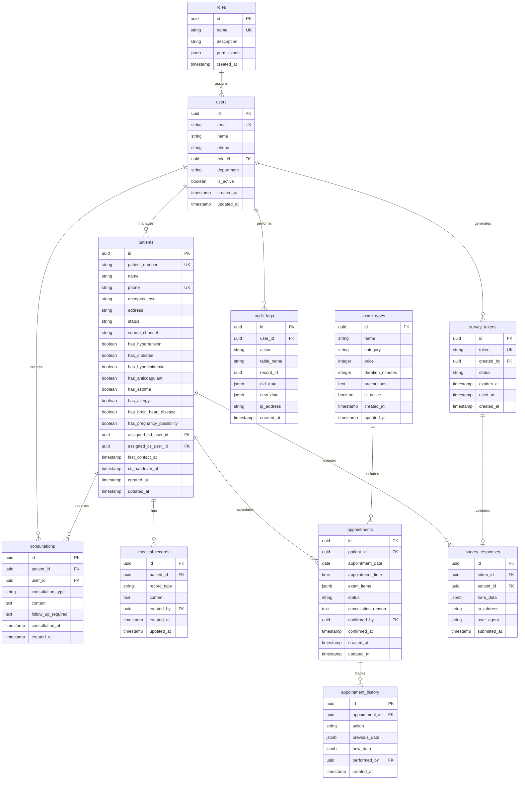

# 데이터베이스 설계 문서

## 개요

본 문서는 NextJS/Supabase 기반 병원 환자 관리 시스템의 데이터베이스 설계를 상세히 설명합니다. PostgreSQL 15+를 기반으로 하며, Supabase의 Row Level Security(RLS)를 활용한 보안 설계를 포함합니다.

## ERD (Entity Relationship Diagram)



## 테이블 상세 명세

### 1. users (사용자)

| 컬럼명 | 데이터 타입 | 제약조건 | 설명 |
|--------|------------|----------|------|
| id | UUID | PK, DEFAULT uuid_generate_v4() | 사용자 고유 식별자 |
| email | VARCHAR(255) | UNIQUE, NOT NULL | 로그인 이메일 |
| name | VARCHAR(100) | NOT NULL | 사용자 실명 |
| phone | VARCHAR(20) | | 연락처 |
| role_id | UUID | FK → roles.id, NOT NULL | 역할 ID |
| department | VARCHAR(100) | | 소속 부서 |
| is_active | BOOLEAN | DEFAULT true | 활성 상태 |
| created_at | TIMESTAMP | DEFAULT CURRENT_TIMESTAMP | 생성일시 |
| updated_at | TIMESTAMP | DEFAULT CURRENT_TIMESTAMP | 수정일시 |

**인덱스:**
- idx_users_email ON email
- idx_users_role_id ON role_id
- idx_users_is_active ON is_active

### 2. roles (역할)

| 컬럼명 | 데이터 타입 | 제약조건 | 설명 |
|--------|------------|----------|------|
| id | UUID | PK | 역할 고유 식별자 |
| name | VARCHAR(50) | UNIQUE, NOT NULL | 역할명 (admin, manager, bd, cs) |
| description | TEXT | | 역할 설명 |
| permissions | JSONB | NOT NULL | 권한 설정 JSON |
| created_at | TIMESTAMP | DEFAULT CURRENT_TIMESTAMP | 생성일시 |

**기본 역할 데이터:**
```sql
-- Admin: 전체 시스템 관리
-- Manager: 통계 및 보고서 조회
-- BD (Business Development): 환자 유치 및 초기 상담
-- CS (Customer Service): 예약 관리 및 고객 응대
```

### 3. patients (환자)

| 컬럼명 | 데이터 타입 | 제약조건 | 설명 |
|--------|------------|----------|------|
| id | UUID | PK | 환자 고유 식별자 |
| patient_number | VARCHAR(20) | UNIQUE, NOT NULL | 환자번호 (자동생성) |
| name | VARCHAR(100) | NOT NULL | 환자명 |
| phone | VARCHAR(20) | NOT NULL | 연락처 |
| encrypted_ssn | TEXT | NOT NULL | 암호화된 주민등록번호 |
| address | TEXT | | 주소 |
| status | VARCHAR(50) | NOT NULL | 상태 (신규접수, CS인계, 예약조율중, 예약확정, 검사완료, 취소) |
| source_channel | VARCHAR(50) | | 유입경로 |
| has_hypertension | BOOLEAN | DEFAULT false | 고혈압 여부 |
| has_diabetes | BOOLEAN | DEFAULT false | 당뇨 여부 |
| has_hyperlipidemia | BOOLEAN | DEFAULT false | 고지혈증 여부 |
| has_anticoagulant | BOOLEAN | DEFAULT false | 항응고제 복용 여부 |
| has_asthma | BOOLEAN | DEFAULT false | 천식 여부 |
| has_allergy | BOOLEAN | DEFAULT false | 알러지 여부 |
| has_brain_heart_disease | BOOLEAN | DEFAULT false | 뇌심장질환 여부 |
| has_pregnancy_possibility | BOOLEAN | DEFAULT false | 임신가능성 여부 |
| assigned_bd_user_id | UUID | FK → users.id | 담당 BD 직원 |
| assigned_cs_user_id | UUID | FK → users.id | 담당 CS 직원 |
| first_contact_at | TIMESTAMP | | 최초 접촉일시 |
| cs_handover_at | TIMESTAMP | | CS 인계일시 |
| created_at | TIMESTAMP | DEFAULT CURRENT_TIMESTAMP | 생성일시 |
| updated_at | TIMESTAMP | DEFAULT CURRENT_TIMESTAMP | 수정일시 |

**인덱스:**
- idx_patients_phone ON phone
- idx_patients_status ON status
- idx_patients_assigned_bd ON assigned_bd_user_id
- idx_patients_assigned_cs ON assigned_cs_user_id
- idx_patients_created_at ON created_at

### 4. medical_records (의료정보)

| 컬럼명 | 데이터 타입 | 제약조건 | 설명 |
|--------|------------|----------|------|
| id | UUID | PK | 의료정보 고유 식별자 |
| patient_id | UUID | FK → patients.id, NOT NULL | 환자 ID |
| record_type | VARCHAR(50) | NOT NULL | 정보유형 (과거력, 가족력, 복약정보, 수술이력, 알러지) |
| content | TEXT | NOT NULL | 상세 내용 |
| created_by | UUID | FK → users.id, NOT NULL | 작성자 |
| created_at | TIMESTAMP | DEFAULT CURRENT_TIMESTAMP | 생성일시 |
| updated_at | TIMESTAMP | DEFAULT CURRENT_TIMESTAMP | 수정일시 |

**인덱스:**
- idx_medical_records_patient ON patient_id
- idx_medical_records_type ON record_type

### 5. consultations (상담기록)

| 컬럼명 | 데이터 타입 | 제약조건 | 설명 |
|--------|------------|----------|------|
| id | UUID | PK | 상담기록 고유 식별자 |
| patient_id | UUID | FK → patients.id, NOT NULL | 환자 ID |
| user_id | UUID | FK → users.id, NOT NULL | 상담 직원 ID |
| consultation_type | VARCHAR(50) | NOT NULL | 상담유형 (전화, 문자, 카카오톡, 방문) |
| content | TEXT | NOT NULL | 상담 내용 |
| follow_up_required | TEXT | | 후속조치 필요사항 |
| consultation_at | TIMESTAMP | NOT NULL | 상담일시 |
| created_at | TIMESTAMP | DEFAULT CURRENT_TIMESTAMP | 생성일시 |

**인덱스:**
- idx_consultations_patient ON patient_id
- idx_consultations_user ON user_id
- idx_consultations_date ON consultation_at

### 6. appointments (예약)

| 컬럼명 | 데이터 타입 | 제약조건 | 설명 |
|--------|------------|----------|------|
| id | UUID | PK | 예약 고유 식별자 |
| patient_id | UUID | FK → patients.id, NOT NULL | 환자 ID |
| appointment_date | DATE | NOT NULL | 예약 날짜 |
| appointment_time | TIME | NOT NULL | 예약 시간 |
| exam_items | JSONB | NOT NULL | 검사 항목 배열 |
| status | VARCHAR(50) | NOT NULL | 상태 (예정, 완료, 취소, 노쇼) |
| cancellation_reason | TEXT | | 취소/변경 사유 |
| confirmed_by | UUID | FK → users.id | 예약 확정 직원 |
| confirmed_at | TIMESTAMP | | 예약 확정일시 |
| created_at | TIMESTAMP | DEFAULT CURRENT_TIMESTAMP | 생성일시 |
| updated_at | TIMESTAMP | DEFAULT CURRENT_TIMESTAMP | 수정일시 |

**인덱스:**
- idx_appointments_patient ON patient_id
- idx_appointments_date ON appointment_date
- idx_appointments_status ON status

### 7. appointment_history (예약변경이력)

| 컬럼명 | 데이터 타입 | 제약조건 | 설명 |
|--------|------------|----------|------|
| id | UUID | PK | 이력 고유 식별자 |
| appointment_id | UUID | FK → appointments.id, NOT NULL | 예약 ID |
| action | VARCHAR(50) | NOT NULL | 액션 (생성, 수정, 취소) |
| previous_data | JSONB | | 이전 데이터 |
| new_data | JSONB | | 변경된 데이터 |
| performed_by | UUID | FK → users.id, NOT NULL | 수행 직원 |
| created_at | TIMESTAMP | DEFAULT CURRENT_TIMESTAMP | 생성일시 |

### 8. survey_tokens (설문토큰)

| 컬럼명 | 데이터 타입 | 제약조건 | 설명 |
|--------|------------|----------|------|
| id | UUID | PK | 토큰 고유 식별자 |
| token | VARCHAR(255) | UNIQUE, NOT NULL | 토큰 문자열 |
| created_by | UUID | FK → users.id, NOT NULL | 생성 직원 |
| status | VARCHAR(50) | NOT NULL | 상태 (미사용, 사용완료, 만료) |
| expires_at | TIMESTAMP | NOT NULL | 만료일시 |
| used_at | TIMESTAMP | | 사용일시 |
| created_at | TIMESTAMP | DEFAULT CURRENT_TIMESTAMP | 생성일시 |

**인덱스:**
- idx_survey_tokens_token ON token
- idx_survey_tokens_status ON status
- idx_survey_tokens_expires ON expires_at

### 9. survey_responses (설문응답)

| 컬럼명 | 데이터 타입 | 제약조건 | 설명 |
|--------|------------|----------|------|
| id | UUID | PK | 응답 고유 식별자 |
| token_id | UUID | FK → survey_tokens.id, NOT NULL | 토큰 ID |
| patient_id | UUID | FK → patients.id | 환자 ID (생성 후 연결) |
| form_data | JSONB | NOT NULL | 설문 응답 데이터 |
| ip_address | INET | | 제출 IP 주소 |
| user_agent | TEXT | | 브라우저 정보 |
| submitted_at | TIMESTAMP | DEFAULT CURRENT_TIMESTAMP | 제출일시 |

### 10. exam_types (검사항목)

| 컬럼명 | 데이터 타입 | 제약조건 | 설명 |
|--------|------------|----------|------|
| id | UUID | PK | 검사항목 고유 식별자 |
| name | VARCHAR(200) | NOT NULL | 검사명 |
| category | VARCHAR(100) | | 검사 카테고리 |
| price | INTEGER | | 검사 비용 |
| duration_minutes | INTEGER | | 예상 소요시간(분) |
| precautions | TEXT | | 주의사항 |
| is_active | BOOLEAN | DEFAULT true | 활성 상태 |
| created_at | TIMESTAMP | DEFAULT CURRENT_TIMESTAMP | 생성일시 |
| updated_at | TIMESTAMP | DEFAULT CURRENT_TIMESTAMP | 수정일시 |

### 11. audit_logs (감사로그)

| 컬럼명 | 데이터 타입 | 제약조건 | 설명 |
|--------|------------|----------|------|
| id | UUID | PK | 로그 고유 식별자 |
| user_id | UUID | FK → users.id | 수행 사용자 |
| action | VARCHAR(50) | NOT NULL | 액션 (INSERT, UPDATE, DELETE) |
| table_name | VARCHAR(100) | NOT NULL | 대상 테이블 |
| record_id | UUID | | 대상 레코드 ID |
| old_data | JSONB | | 이전 데이터 |
| new_data | JSONB | | 변경된 데이터 |
| ip_address | INET | | IP 주소 |
| created_at | TIMESTAMP | DEFAULT CURRENT_TIMESTAMP | 생성일시 |

**인덱스:**
- idx_audit_logs_user ON user_id
- idx_audit_logs_table ON table_name
- idx_audit_logs_created ON created_at

## Row Level Security (RLS) 정책

### 1. patients 테이블 RLS

```sql
-- BD 직원: 본인이 담당하는 환자만 조회/수정
CREATE POLICY "BD can view own patients" ON patients
    FOR SELECT USING (
        auth.uid() = assigned_bd_user_id 
        OR EXISTS (
            SELECT 1 FROM users 
            WHERE users.id = auth.uid() 
            AND users.role_id IN (
                SELECT id FROM roles WHERE name IN ('admin', 'manager')
            )
        )
    );

-- CS 직원: CS 인계된 환자만 조회/수정
CREATE POLICY "CS can view assigned patients" ON patients
    FOR SELECT USING (
        (status IN ('CS팀인계', '예약조율중', '예약확정') 
         AND auth.uid() = assigned_cs_user_id)
        OR EXISTS (
            SELECT 1 FROM users 
            WHERE users.id = auth.uid() 
            AND users.role_id IN (
                SELECT id FROM roles WHERE name IN ('admin', 'manager')
            )
        )
    );
```

### 2. medical_records 테이블 RLS

```sql
-- 환자 담당 직원만 의료정보 조회 가능
CREATE POLICY "Staff can view assigned patient medical records" ON medical_records
    FOR SELECT USING (
        EXISTS (
            SELECT 1 FROM patients p
            WHERE p.id = medical_records.patient_id
            AND (p.assigned_bd_user_id = auth.uid() 
                 OR p.assigned_cs_user_id = auth.uid())
        )
        OR EXISTS (
            SELECT 1 FROM users 
            WHERE users.id = auth.uid() 
            AND users.role_id IN (
                SELECT id FROM roles WHERE name IN ('admin', 'manager')
            )
        )
    );
```

### 3. consultations 테이블 RLS

```sql
-- 본인이 작성한 상담기록 또는 담당 환자의 상담기록만 조회
CREATE POLICY "Staff can view relevant consultations" ON consultations
    FOR SELECT USING (
        user_id = auth.uid()
        OR EXISTS (
            SELECT 1 FROM patients p
            WHERE p.id = consultations.patient_id
            AND (p.assigned_bd_user_id = auth.uid() 
                 OR p.assigned_cs_user_id = auth.uid())
        )
        OR EXISTS (
            SELECT 1 FROM users 
            WHERE users.id = auth.uid() 
            AND users.role_id IN (
                SELECT id FROM roles WHERE name IN ('admin', 'manager')
            )
        )
    );
```

## 데이터베이스 함수 및 트리거

### 1. 환자번호 자동 생성

```sql
CREATE OR REPLACE FUNCTION generate_patient_number()
RETURNS TRIGGER AS $$
BEGIN
    NEW.patient_number := 'P' || TO_CHAR(CURRENT_DATE, 'YYYYMMDD') || 
                         LPAD(NEXTVAL('patient_number_seq')::TEXT, 4, '0');
    RETURN NEW;
END;
$$ LANGUAGE plpgsql;

CREATE TRIGGER set_patient_number
    BEFORE INSERT ON patients
    FOR EACH ROW
    EXECUTE FUNCTION generate_patient_number();
```

### 2. 자동 타임스탬프 업데이트

```sql
CREATE OR REPLACE FUNCTION update_updated_at_column()
RETURNS TRIGGER AS $$
BEGIN
    NEW.updated_at = CURRENT_TIMESTAMP;
    RETURN NEW;
END;
$$ LANGUAGE plpgsql;

-- 각 테이블에 트리거 적용
CREATE TRIGGER update_patients_updated_at BEFORE UPDATE ON patients
    FOR EACH ROW EXECUTE FUNCTION update_updated_at_column();
```

### 3. 감사 로그 자동 생성

```sql
CREATE OR REPLACE FUNCTION create_audit_log()
RETURNS TRIGGER AS $$
BEGIN
    INSERT INTO audit_logs (
        user_id, action, table_name, record_id, 
        old_data, new_data, ip_address
    ) VALUES (
        auth.uid(), TG_OP, TG_TABLE_NAME, 
        COALESCE(NEW.id, OLD.id),
        CASE WHEN TG_OP = 'DELETE' THEN row_to_json(OLD) ELSE NULL END,
        CASE WHEN TG_OP IN ('INSERT', 'UPDATE') THEN row_to_json(NEW) ELSE NULL END,
        inet_client_addr()
    );
    RETURN NEW;
END;
$$ LANGUAGE plpgsql;
```

### 4. 설문 제출 시 환자 자동 생성 (RPC Function)

```sql
-- 설문 제출을 처리하고 환자 레코드를 자동 생성하는 함수
CREATE OR REPLACE FUNCTION submit_survey(
    p_token_id UUID,
    p_form_data JSONB,
    p_created_by UUID
) RETURNS TABLE (
    id UUID,
    patient_number VARCHAR,
    name VARCHAR
) AS $$
DECLARE
    v_patient_id UUID;
    v_patient_number VARCHAR;
    v_health_conditions JSONB;
    v_additional_info TEXT;
    v_medications TEXT;
BEGIN
    -- 트랜잭션 시작
    
    -- 1. 토큰 유효성 확인
    UPDATE survey_tokens 
    SET status = 'used', used_at = CURRENT_TIMESTAMP
    WHERE id = p_token_id 
        AND status = 'active' 
        AND expires_at > CURRENT_TIMESTAMP;
        
    IF NOT FOUND THEN
        RAISE EXCEPTION 'Invalid or expired token';
    END IF;
    
    -- 2. 환자 생성
    v_patient_id := uuid_generate_v4();
    
    -- 건강정보 추출
    v_health_conditions := p_form_data->'healthConditions';
    v_additional_info := p_form_data->>'additionalMedicalInfo';
    v_medications := p_form_data->>'currentMedications';
    
    INSERT INTO patients (
        id, name, phone, encrypted_ssn, address,
        status, source_channel, assigned_bd_user_id,
        has_hypertension, has_diabetes, has_hyperlipidemia,
        has_anticoagulant, has_asthma, has_allergy,
        has_brain_heart_disease, has_pregnancy_possibility,
        created_at
    ) VALUES (
        v_patient_id,
        p_form_data->>'name',
        p_form_data->>'phone',
        p_form_data->>'encrypted_ssn',
        p_form_data->>'address',
        '신규접수',
        '대외협력',
        p_created_by,
        v_health_conditions ? '고혈압',
        v_health_conditions ? '당뇨',
        v_health_conditions ? '고지혈증',
        v_health_conditions ? '항응고제/항혈소판제 복용',
        v_health_conditions ? '천식',
        v_health_conditions ? '특정 약물/음식 알러지',
        v_health_conditions ? '뇌/심장 질환',
        v_health_conditions ? '임신 가능성',
        CURRENT_TIMESTAMP
    ) RETURNING patient_number INTO v_patient_number;
    
    -- 3. 설문 응답 저장
    INSERT INTO survey_responses (
        token_id, patient_id, form_data, submitted_at
    ) VALUES (
        p_token_id, v_patient_id, p_form_data, CURRENT_TIMESTAMP
    );
    
    -- 4. 의료 정보 자동 생성
    IF v_additional_info IS NOT NULL AND v_additional_info != '' THEN
        INSERT INTO medical_records (
            patient_id, record_type, content, created_by
        ) VALUES (
            v_patient_id, '과거력', v_additional_info, p_created_by
        );
    END IF;
    
    IF v_medications IS NOT NULL AND v_medications != '' THEN
        INSERT INTO medical_records (
            patient_id, record_type, content, created_by
        ) VALUES (
            v_patient_id, '복약정보', v_medications, p_created_by
        );
    END IF;
    
    -- 5. 상담 로그 생성
    INSERT INTO consultations (
        patient_id, user_id, consultation_type, content, consultation_at
    ) VALUES (
        v_patient_id, p_created_by, '시스템', 
        '설문을 통한 신규 환자 등록', CURRENT_TIMESTAMP
    );
    
    -- 6. 실시간 알림을 위한 이벤트 트리거
    PERFORM pg_notify(
        'new_survey_submission',
        json_build_object(
            'patient_id', v_patient_id,
            'patient_name', p_form_data->>'name',
            'assigned_to', p_created_by,
            'submitted_at', CURRENT_TIMESTAMP
        )::text
    );
    
    -- 결과 반환
    RETURN QUERY
    SELECT v_patient_id, v_patient_number, p_form_data->>'name'::VARCHAR;
END;
$$ LANGUAGE plpgsql SECURITY DEFINER;

-- 함수 실행 권한 설정
GRANT EXECUTE ON FUNCTION submit_survey TO authenticated;
```

## 데이터 암호화

### 주민등록번호 암호화

```typescript
// 암호화 함수 (서버 사이드)
import crypto from 'crypto';

const algorithm = 'aes-256-gcm';
const secretKey = process.env.ENCRYPTION_KEY!;

export function encryptSSN(ssn: string): string {
    const iv = crypto.randomBytes(16);
    const cipher = crypto.createCipheriv(algorithm, Buffer.from(secretKey, 'hex'), iv);
    
    let encrypted = cipher.update(ssn, 'utf8', 'hex');
    encrypted += cipher.final('hex');
    
    const authTag = cipher.getAuthTag();
    
    return iv.toString('hex') + ':' + authTag.toString('hex') + ':' + encrypted;
}

export function decryptSSN(encryptedSSN: string): string {
    const parts = encryptedSSN.split(':');
    const iv = Buffer.from(parts[0], 'hex');
    const authTag = Buffer.from(parts[1], 'hex');
    const encrypted = parts[2];
    
    const decipher = crypto.createDecipheriv(algorithm, Buffer.from(secretKey, 'hex'), iv);
    decipher.setAuthTag(authTag);
    
    let decrypted = decipher.update(encrypted, 'hex', 'utf8');
    decrypted += decipher.final('utf8');
    
    return decrypted;
}
```

## 성능 최적화

### 1. 인덱싱 전략
- 자주 검색되는 컬럼에 인덱스 생성
- 복합 인덱스 활용으로 쿼리 성능 향상
- 부분 인덱스로 저장 공간 최적화

### 2. 파티셔닝
```sql
-- 감사 로그 테이블 월별 파티셔닝
CREATE TABLE audit_logs_2024_01 PARTITION OF audit_logs
    FOR VALUES FROM ('2024-01-01') TO ('2024-02-01');
```

### 3. 뷰 활용
```sql
-- 오늘의 검사 현황 뷰
CREATE VIEW today_appointments AS
SELECT 
    a.*, 
    p.name as patient_name,
    p.phone as patient_phone,
    u.name as bd_name
FROM appointments a
JOIN patients p ON a.patient_id = p.id
LEFT JOIN users u ON p.assigned_bd_user_id = u.id
WHERE a.appointment_date = CURRENT_DATE
    AND a.status = '예정';
```

## 백업 및 복구 전략

### 1. 자동 백업
- Supabase 자동 일일 백업 (최근 7일)
- Point-in-time recovery 지원

### 2. 수동 백업
```bash
# 전체 데이터베이스 백업
pg_dump -h db.supabase.co -U postgres -d postgres > backup_$(date +%Y%m%d).sql

# 특정 테이블 백업
pg_dump -h db.supabase.co -U postgres -d postgres -t patients > patients_backup.sql
```

### 3. 복구 절차
```bash
# 백업 파일로부터 복구
psql -h db.supabase.co -U postgres -d postgres < backup_20240315.sql
```

---

본 문서는 병원 환자 관리 시스템의 데이터베이스 설계를 상세히 설명합니다. 이 설계는 확장성, 보안성, 성능을 고려하여 작성되었으며, Supabase의 기능을 최대한 활용합니다.