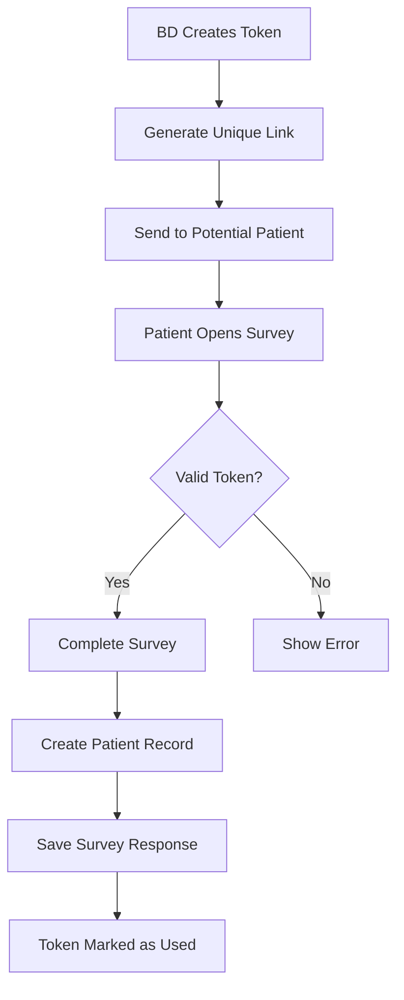
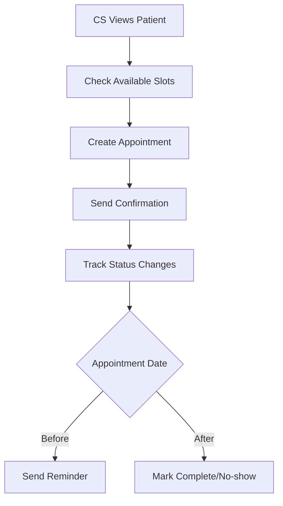

# Survey & Appointment Workflow Documentation

## Overview

This document describes the implementation of the survey token system and appointment management functionality for the Hospital Management System.

## Workflow Architecture

### 1. Survey Token Flow



### 2. Appointment Booking Flow



## Database Schema

### Survey Tokens Table
```sql
CREATE TABLE survey_tokens (
  token UUID PRIMARY KEY,
  created_by UUID,           -- BD who created
  patient_name VARCHAR(100), -- Temporary storage
  patient_phone VARCHAR(20),
  patient_email VARCHAR(255),
  patient_id UUID,           -- Linked after survey
  expires_at TIMESTAMPTZ,    -- Default 7 days
  used_at TIMESTAMPTZ,       -- When survey completed
  survey_data JSONB         -- Pre-filled data
);
```

### Survey Responses Table
```sql
CREATE TABLE survey_responses (
  id UUID PRIMARY KEY,
  survey_token UUID,
  patient_id UUID,
  survey_type VARCHAR(50),
  responses JSONB,          -- Flexible survey data
  metadata JSONB,           -- Browser info, timing
  started_at TIMESTAMPTZ,
  completed_at TIMESTAMPTZ
);
```

### Appointments Table
```sql
CREATE TABLE appointments (
  id UUID PRIMARY KEY,
  patient_id UUID,
  scheduled_at TIMESTAMPTZ,
  duration_minutes INTEGER,
  status appointment_status,  -- pending/confirmed/cancelled/completed/no_show
  consultation_type VARCHAR(50),
  cs_notes TEXT,
  internal_notes TEXT,
  reminder_sent BOOLEAN,
  created_by UUID,
  assigned_to UUID
);
```

## Implementation Features

### 1. Survey Token System

#### Token Creation (BD Role)
```typescript
const surveyService = new SurveyService();

// BD creates survey token
const token = await surveyService.createSurveyToken({
  patient_name: "김철수",
  patient_phone: "010-1234-5678",
  patient_email: "kim@example.com",
  survey_data: {
    referral_source: "online_ad",
    consultation_interest: "general_checkup"
  }
});

// Generate shareable link
const surveyLink = surveyService.generateSurveyLink(token.token);
console.log(surveyLink); // https://app.com/survey/uuid-token
```

#### Survey Completion (Public Access)
```typescript
// Public survey page
const token = await surveyService.getToken(tokenId);

if (!token || token.used_at) {
  throw new Error("Invalid or used token");
}

// Use token and create patient
const usedToken = await surveyService.useToken(tokenId, {
  name: "김철수",
  ssn: "901231-1234567",
  phone: "010-1234-5678",
  email: "kim@example.com"
});

// Save survey responses
const response = await surveyService.saveSurveyResponse(tokenId, {
  survey_type: "pre_consultation",
  responses: {
    chief_complaint: "Regular checkup",
    medical_history: ["diabetes", "hypertension"],
    medications: ["metformin"],
    allergies: ["penicillin"]
  },
  metadata: {
    browser: navigator.userAgent,
    completion_time: 300 // seconds
  }
});

// Mark as completed
await surveyService.completeSurveyResponse(response.id);
```

### 2. Appointment Management

#### Creating Appointments (CS Role)
```typescript
const appointmentService = new AppointmentService();

// Check available slots
const slots = await appointmentService.getAvailableSlots(
  "2024-01-01",
  "2024-01-07",
  30 // duration in minutes
);

// Create appointment
const appointment = await appointmentService.createAppointment({
  patient_id: "patient-uuid",
  scheduled_at: "2024-01-03T10:00:00Z",
  duration_minutes: 30,
  consultation_type: "general",
  cs_notes: "First time patient, needs general checkup",
  assigned_to: "cs-staff-uuid"
});
```

#### Managing Appointment Status
```typescript
// Confirm appointment
await appointmentService.confirmAppointment(appointmentId);

// Cancel with reason
await appointmentService.cancelAppointment(
  appointmentId, 
  "Patient requested reschedule"
);

// Complete appointment
await appointmentService.completeAppointment(
  appointmentId,
  "Consultation completed successfully. Follow-up in 3 months."
);

// View status history
const history = await appointmentService.getAppointmentHistory(appointmentId);
```

### 3. Automated Features

#### Token Expiry Cleanup
```sql
-- Automatic cleanup of expired unused tokens
CREATE OR REPLACE FUNCTION cleanup_expired_tokens()
RETURNS void AS $$
BEGIN
  DELETE FROM survey_tokens
  WHERE expires_at < NOW()
  AND used_at IS NULL;
END;
$$ LANGUAGE plpgsql;
```

#### Status Change Tracking
```sql
-- Automatic history recording on status change
CREATE TRIGGER appointment_status_change_trigger
  AFTER UPDATE OF status ON appointments
  FOR EACH ROW
  EXECUTE FUNCTION record_appointment_status_change();
```

#### Appointment Reminders
```typescript
// Get appointments needing reminders
const appointments = await appointmentService.getAppointmentsNeedingReminders();

for (const appointment of appointments) {
  // Send reminder (SMS/Email)
  await sendReminder(appointment);
  
  // Mark as sent
  await appointmentService.markReminderSent(appointment.id);
}
```

## Security & Access Control

### Row Level Security (RLS)

#### Survey Tokens
- **BD**: Can create and view their own tokens
- **Public**: Can view tokens for survey access
- **Admin**: Full access

#### Survey Responses
- **BD**: Can view responses from their tokens
- **CS**: Can view responses for their patients
- **Admin/Manager**: Full access

#### Appointments
- **CS**: Can create/update appointments
- **BD**: Can view appointments for their patients
- **Admin/Manager**: Full access

### Data Privacy
- Survey links are UUID-based (unguessable)
- Tokens expire after 7 days
- Patient data created only after survey completion
- SSN encryption handled by patient service

## Best Practices

### 1. Token Management
- Set appropriate expiry times (default 7 days)
- Clean up expired tokens regularly
- Monitor token usage rates
- Track conversion (token created → patient created)

### 2. Appointment Scheduling
- Validate slot availability before booking
- Send confirmation immediately
- Send reminders 24 hours before
- Track no-show rates

### 3. Survey Design
- Keep surveys concise
- Use JSONB for flexible question types
- Save progress incrementally
- Include completion metrics

### 4. Performance Optimization
- Indexes on all foreign keys
- Partial indexes for filtered queries
- Regular VACUUM on high-churn tables
- Monitor slow queries

## Integration Examples

### Survey Link in SMS/Email
```typescript
const sendSurveyInvitation = async (token: SurveyToken) => {
  const link = surveyService.generateSurveyLink(token.token);
  
  // SMS
  await smsService.send({
    to: token.patient_phone,
    message: `안녕하세요. 병원 사전 문진표 작성 링크입니다: ${link}`
  });
  
  // Email
  await emailService.send({
    to: token.patient_email,
    subject: "병원 방문 전 설문조사",
    html: `<a href="${link}">설문 시작하기</a>`
  });
};
```

### Dashboard Widgets
```typescript
// BD Dashboard - Token Statistics
const getTokenStats = async () => {
  const tokens = await surveyService.getMyTokens();
  
  return {
    total: tokens.length,
    used: tokens.filter(t => t.used_at).length,
    expired: tokens.filter(t => !t.used_at && t.expires_at < new Date()).length,
    pending: tokens.filter(t => !t.used_at && t.expires_at >= new Date()).length
  };
};

// CS Dashboard - Today's Appointments
const getTodaysAppointments = async () => {
  const today = new Date().toISOString().split('T')[0];
  
  return appointmentService.getMyAppointments({
    dateFrom: `${today}T00:00:00Z`,
    dateTo: `${today}T23:59:59Z`
  });
};
```

## Migration & Deployment

### Local Testing
```bash
# Apply migrations
npm run supabase:reset

# Test token creation
npm run test:surveys

# Test appointment booking
npm run test:appointments
```

### Production Deployment
1. Apply migrations to production
2. Test token expiry cleanup
3. Verify RLS policies
4. Monitor performance
5. Set up automated reminders

## Troubleshooting

### Common Issues

1. **"Survey token already used"**
   - Token can only be used once
   - Create new token if needed

2. **"Survey token expired"**
   - Default expiry is 7 days
   - Adjust in token creation if needed

3. **"No available slots"**
   - Check business hours configuration
   - Verify no overlapping appointments

4. **Performance Issues**
   - Check index usage with EXPLAIN
   - Monitor token table size
   - Archive old appointments